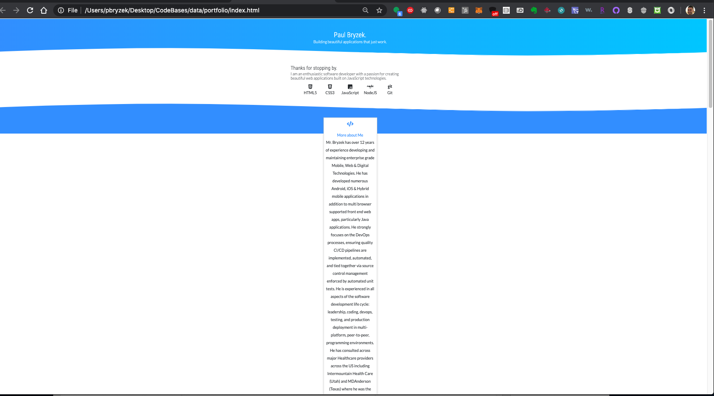

# Bootcamp: UCB-VIRT-DATA-PT-03-2020-U-B-TTH

### Bootcamp Challenge #10 - 5/17/2020
Bootcamp Challenge 10: Module Mission to Mars

### Portfolio

[Portfolio PDF](./assets/portfolio.pdf)

### Jupyter Notebooks Created
- [Mission To Mars](Mission_to_Mars.ipynb)

### Links Used
- [Mars News](https://mars.nasa.gov/news/)
- [Mars Hemispheres](https://astrogeology.usgs.gov/search/results?q=hemisphere+enhanced&k1=target&v1=Mars)

### Challenge Description
**Objectives**
- Use BeautifulSoup and Splinter to automate a web browser and scrape high-resolution images.
- Use a MongoDB database to store data from the web scrape.
- Update the web application and Flask to display the data from the web scrape.
- Use Bootstrap to style the web app.

## Methodology: 
Utilized Beautiful Soup and Splinter to utilize automation via a browser to visit two different NASA sites to scrape public data. Used the Chrome developer tools feature to inspect the elements on the two pages to find the data required by first the module then the challenge. I used Jupyter notebook to test out the scraping then converted that into a Python file. 

I created a separate app.py file which encapsulated the Flask App and allowed me to define different routes. I enabled routes to scrape_all (module) and scrape_images (challenge). After scraping the data, it was stored in a Mongo DB instance "mars_db" in two different collections. 

I also added a HTML template to load a HTML page when visiting the root dir from the index.html stored in templates dir. This is the home page and allows the User to click buttons to initiate the APIs. It also queries data from Mongo and utilizes the image URLs to add to the src in an HTML img element to display the feature images, the hemisphere images, as well as the Mars Facts.

### App Accessible URLs
- http://127.0.0.1:5000/scrape_images - To scrape the Hemisphere Images and store in a Mongo DB "mars_db" collection "mars.images"
- http://127.0.0.1:5000/scrape_all - To scrape the Mars News and Facts and store them in a Mongo DB "mars_db" collection "mars.facts"
- http://127.0.0.1:5000/ - Accesses the homepage which has two UI buttons that allow to call the scrape APIs. If data is in the mongo DB, it will display the data on the webpage.

### Bootstrap UI Updates
As per the challenge instructions, I updated the UI in various places:
- Added Nav Bar with simple header and name
- Added a button to the nav bar that will take the user back to the home page
- Added a row of 4 buttons to display the 4 Mars' hemispheres
- Upon clicking each hemisphere button, an enlarged card view displays below the buttons.
- Added another button to allow user to either scrape Mars Facts or the Hemispheres APIs.
- Added appropriate headers for new sections displayed.
